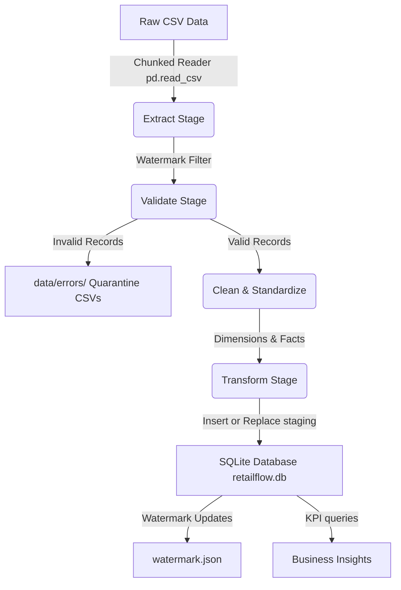
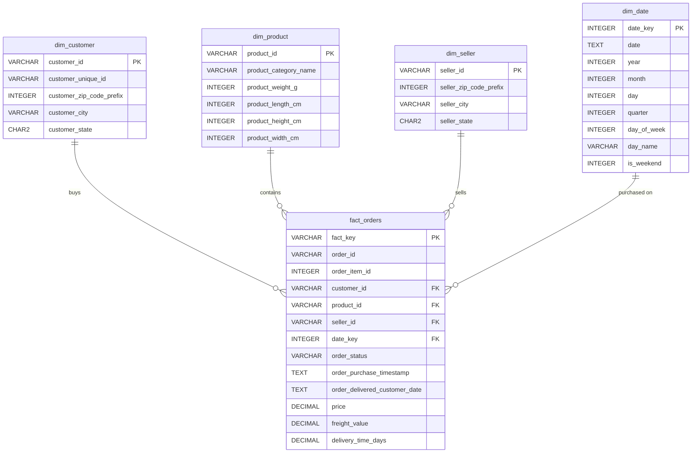

# RetailFlow — Upgraded Production-Grade ETL Pipeline & Analytics Platform

`RetailFlow` is an end-to-end, production-style Data Engineering project that processes the Olist Brazilian E-Commerce dataset into a relational Star Schema in SQLite. 

Designed to showcase software engineering best practices for data engineers, this pipeline incorporates robust production features—such as **memory-efficient chunking**, **data validation with a quarantine area**, **incremental loading using watermarking**, and **centralized logging/reports**—while keeping the codebase clear, modular, and easy to explain in a fresher interview.

---

## 🚀 Architecture & Features



### 1. Chunked Memory Management
To process large datasets without high memory consumption, Pandas reads CSV files in configurable batches (e.g. `10,000` rows at a time) using the `chunksize` parameter. This guarantees a constant memory footprint regardless of dataset size.

### 2. Validation & Quarantine
Raw data chunks are validated against validation rules defined in `config.py` (e.g., non-null check for key identifiers, valid state length, non-negative monetary figures). Invalid rows are appended to specific quarantine files in `data/errors/` with a `quarantine_reason` column, ensuring data visibility and auditability.

### 3. Incremental Load using Watermarks
The pipeline reads `watermark.json` to get the timestamp of the last processed order (`last_processed_timestamp`).
* **Orders**: Filtered to only process rows where `order_purchase_timestamp > watermark`.
* **Order Items**: Incremental runs extract and load only items belonging to the new orders.
* **Dimensions** (Customers, Products, Sellers): Master directories are read in chunks and loaded using SQLite **Upsert (`INSERT OR REPLACE`)** logic, preventing duplicate key violations and keeping references updated.

### 4. Logging & Monitoring
* **Centralized Logs**: All runs, successes, warnings, and error messages are written using Python's `logging` module to both the standard output and `logs/etl.log` with detailed line locations.
* **Pipeline Summary Report**: At the end of every execution, counts of total, valid, and invalid processed records for each dataset are appended to `data/pipeline_summary.csv` for monitoring and auditing.

---

## 📁 Project Structure

```text
RetailFlow/
├── data/
│   ├── raw/                 # Input CSVs (Olist Brazilian E-Commerce dataset)
│   ├── errors/              # Quarantined invalid records (.csv files)
│   └── pipeline_summary.csv # Run statistics and audit trails
├── etl/
│   ├── config.py            # Global variables, paths, logging, and schemas
│   ├── extract.py           # Chunk extraction and watermark loading
│   ├── validate.py          # Data validation constraints and quarantine writer
│   ├── clean.py             # Data standardizations (casing, trimming, dates)
│   ├── transform.py         # Star schema mapping and Date Dimension generator
│   ├── load.py              # Staging table SQL upserts and DB initialization
│   └── pipeline.py          # Pipeline orchestrator (end-to-end execution)
├── sql/
│   ├── schema.sql           # Star schema DDL definitions and indexes
│   └── analytics.sql        # KPI analytics queries (Revenue, top sellers, etc.)
├── logs/
│   └── etl.log              # central log file
├── watermark.json           # Stores latest processed purchase timestamp
├── retailflow.db            # SQLite target data warehouse
└── README.md                # Documentation (this file)
```

---

## 📊 Star Schema Design

The data is modeled using a classic **Star Schema** designed for fast analytical queries:



* **fact_orders**: Modeled at the **order-item level** (grain is one row per product item in an order). This allows direct queries joining sellers, products, and customers. It includes pre-calculated metrics like `price`, `freight_value`, and `delivery_time_days`.

---

## 🛠️ Setup & Execution

### 1. Ingest Raw Data
Ensure your Olist Brazilian E-Commerce dataset CSV files are placed inside the `data/raw/` directory.

### 2. Execute the Pipeline
Run the orchestrator from the project root directory:
```bash
python -m etl.pipeline
```
This script will:
1. Initialize the SQLite database schema if not already created.
2. Load any existing watermark.
3. Process dimensions in chunks and upsert records.
4. Process orders and items incrementally.
5. Perform SQL-based star schema transformations.
6. Generate validation reports and update the watermark.

### 3. Check Logs and Quarantine Files
* Check runtime logs in `logs/etl.log`.
* Inspect any quarantined invalid records in `data/errors/`.
* Audit run statistics in `data/pipeline_summary.csv`.

---

## 📈 SQL KPI Queries

We have implemented four business queries inside `sql/analytics.sql` which can be executed directly against `retailflow.db`:

1. **Revenue by Month**:
   ```sql
   SELECT d.year, d.month, ROUND(SUM(f.price), 2) as monthly_revenue
   FROM fact_orders f
   JOIN dim_date d ON f.date_key = d.date_key
   WHERE f.order_status = 'delivered'
   GROUP BY d.year, d.month
   ORDER BY d.year, d.month;
   ```
2. **Top Sellers**:
   ```sql
   SELECT s.seller_id, s.seller_city, s.seller_state, ROUND(SUM(f.price), 2) as total_revenue
   FROM fact_orders f
   JOIN dim_seller s ON f.seller_id = s.seller_id
   WHERE f.order_status = 'delivered'
   GROUP BY s.seller_id
   ORDER BY total_revenue DESC LIMIT 10;
   ```
3. **Average Delivery Time**:
   ```sql
   SELECT c.customer_state, ROUND(AVG(f.delivery_time_days), 2) as avg_delivery_time_days
   FROM fact_orders f
   JOIN dim_customer c ON f.customer_id = c.customer_id
   WHERE f.order_status = 'delivered' AND f.delivery_time_days IS NOT NULL
   GROUP BY c.customer_state
   ORDER BY avg_delivery_time_days ASC;
   ```
4. **Orders by State**:
   ```sql
   SELECT c.customer_state, COUNT(DISTINCT f.order_id) as total_orders
   FROM fact_orders f
   JOIN dim_customer c ON f.customer_id = c.customer_id
   GROUP BY c.customer_state
   ORDER BY total_orders DESC;
   ```
